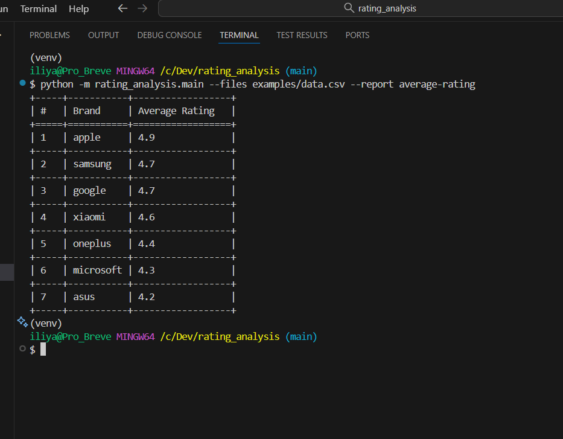
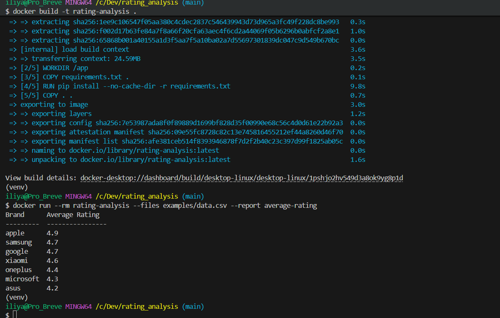

# Инструмент анализа рейтинга брендов

[](https://github.com/Iliya-Vilkov/rating_analysis/actions/workflows/test.yml)


Инструмент на Python для анализа рейтингов продуктов из CSV файлов и генерации отчетов.
Разработан как тестовое задание для компании Workmate, не для коммерческого использования.
Опционально доступен запуск проекта через Docker
Дополнительно настроен workflow на GitHub Actions. Статус отображен в документации.

Проект полностью готов для дальнейшей разработки, настройки CI/CD, деплою на сервер и продакшену.

В надежде на долгосрочное сотрудничество.

Приятного использования.


## Быстрая настройка и запуск

Для автоматической установки зависимостей и проверки работоспособности используйте скрипт(работает на Windows и Linux, для запуска на Mac воспользуйтесь образом Docker - инструкция ниже):

```bash
./setup_and_test.sh
```

## Самостоятельная установка

1. Убедитесь, что у вас установлен Python 3.8 или новее
   ```bash
   python --version  # Должен показать Python 3.8 или выше
   ```
   
   Проект требует Python 3.8+ так как использует:
   - Аннотации типов со стандартными коллекциями (List, Dict и т.д.)
   - Классы данных (dataclasses)
   - f-строки

2. Установите зависимости:

   ```bash
   # Установка основных зависимостей
   pip install -r requirements.txt
   ```

## Использование

Скрипт принимает CSV файлы, содержащие данные о рейтингах продуктов, и генерирует отчеты заданного типа.

### Базовое использование:
```bash
python -m rating_analysis.main --files data1.csv data2.csv --report average-rating
```

### Формат CSV файла

Входные CSV файлы должны содержать следующие столбцы:
- name: Название продукта
- brand: Название бренда
- price: Цена продукта
- rating: Рейтинг продукта

Пример:
```csv
name,brand,price,rating
iphone 15 pro,apple,999,4.9
galaxy s23 ultra,samsung,1199,4.8
redmi note 12,xiaomi,199,4.6
```

## Добавление новых отчетов

Чтобы добавить новый тип отчета:

1. Создайте новый файл в директории `src/report/`
2. Создайте новый класс, наследующийся от `BaseReport`
3. Реализуйте метод `generate`
4. Добавьте новый класс отчета в словарь `reports` в файле `src/main.py`

## Разработка

- Форматирование кода: `black .`
- Сортировка импортов: `isort .`
- Проверка стиля кода: `flake8`
- Запуск тестов: `pytest`
- Проверка покрытия: `pytest --cov`

## Пример работы

Ниже показан пример запуска скрипта с реальными данными.

### Команда:
```bash
python -m rating_analysis.main --files examples/data.csv --report average-rating
```

### Результат:


### Тесты и покрытие кода:


## Запуск через Docker

Вы можете запустить приложение в контейнере Docker.

### Сборка образа:
```bash
docker build -t rating-analysis .
```

### Запуск:
```bash
docker run --rm rating-analysis --files examples/data.csv --report average-rating
```

### Результат:


## О разработчике

- Имя: Iliya Vilkov
- GitHub: https://github.com/Iliya-Vilkov
- Вопросы и предложения: создавайте Issue — https://github.com/Iliya-Vilkov/rating_analysis/issues
- Email: enot19vilkov@yandex.ru
- Telegram: https://t.me/EnotDD
- LinkedIn: https://www.linkedin.com/in/ilia-vilkov-52806a391/

Если у вас есть идеи по улучшению проекта или вы нашли ошибку — пишите или создавайте Issue, буду рад обратной связи.

